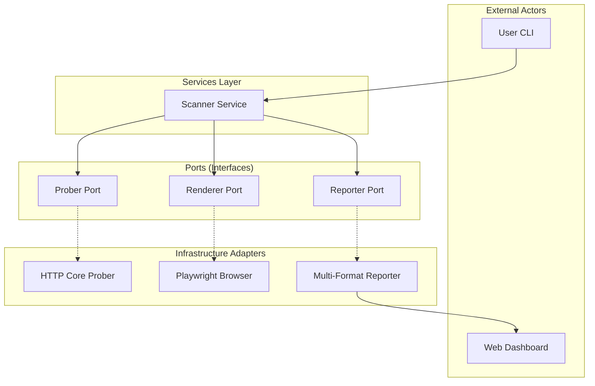

# 👁️ NetVista v2.1.0-pro

<p align="center">
  
</p>

<p align="center">
  
  
  
  
</p>

---

**NetVista v2.1.0-pro** is an enterprise-grade **Visual Reconnaissance & Intelligence** engine. Built with a robust **Hexagonal Architecture**, it transforms raw target lists into actionable visual insights by combining smart rendering, technology fingerprinting, and visual deduplication.

## 🚀 Key Capabilities

### 🧠 Visual Intelligence
- **Perceptual Hashing (pHash)**: Automatically groups visually identical hosts to eliminate report noise.
- **Framework Fingerprinting**: Deep detection of modern SPA frameworks (React, Vue, Angular) and legacy technologies.
- **Smart Interactions**: Automated detection and bypass of cookie consent overlays and common popups.

### 🏗️ Enterprise Architecture
- **Hexagonal Design**: Core business logic is strictly decoupled from infrastructure, ensuring long-term maintainability.
- **Browser Pooling**: High-performance browser context management with thread-safe pooling.
- **Resource Aware**: Adaptive concurrency and smart retries with exponential backoff.

### 📊 Professional Outputs
- **Interactive Multi-Report**: One-click generation of JSON, CSV, Markdown, and TXT reports.
- **Web Dashboard 2.0**: A built-in surveillance dashboard to browse results in real-time.
- **Incremental Scanning**: Intelligent logic that skips previously scanned targets to optimize resources.

---

## 🏗️ Architecture Visualization

NetVista utilizes the **Ports & Adapters (Hexagonal)** pattern to ensure the core engine remains platform-agnostic.



---

## 🛠️ Installation

### Prerequisites
- [Go](https://go.dev/dl/) 1.21 or higher.
- [Playwright for Go](https://github.com/playwright-community/playwright-go) (Dependencies installed automatically).

### Setup
```bash
git clone https://github.com/ismailtsdln/netvista
cd netvista
go build -o netvista cmd/netvista/main.go
```

---

## 📖 Usage Guide

### 📂 Port Scanning & Capture
Pipe any list of URLs or IP addresses into NetVista.

```bash
# Basic scan
echo "example.com" | ./netvista scan -o my_scan

# Comprehensive scan with custom ports and concurrency
cat targets.txt | ./netvista scan -p 80,443,8080 -c 10 -o reports/prod
```

### 🔍 Specialized Input
Parse Nmap XML files for visual verification.
```bash
./netvista scan --nmap staging_network.xml -o staging_recon
```

### 🖥️ Surveillance Dashboard
Launch the interactive viewer to analyze your findings.
```bash
./netvista serve -d reports/prod -p 9090
```

---

## ⚙️ Configuration (`netvista.yaml`)

NetVista can be fine-tuned via a configuration file for enterprise deployments.

```yaml
ports: "top-100"          # Presets: top-100, top-1000, full
concurrency: 20           # Number of simultaneous scanning threads
max_browser_contexts: 10  # Max active Playwright contexts
output: "./reports"       # Default output directory
timeout: "10s"            # Global timeout per host
proxy: ""                 # HTTP/SOCKS5 Proxy (optional)
```

---

## 🛡️ Credits & Contribution

Created and maintained by **İsmail Taşdelen**. Contributions are welcome via Pull Requests.

---
*Generated by NetVista Engine - Empowering Reconnaissance.*
